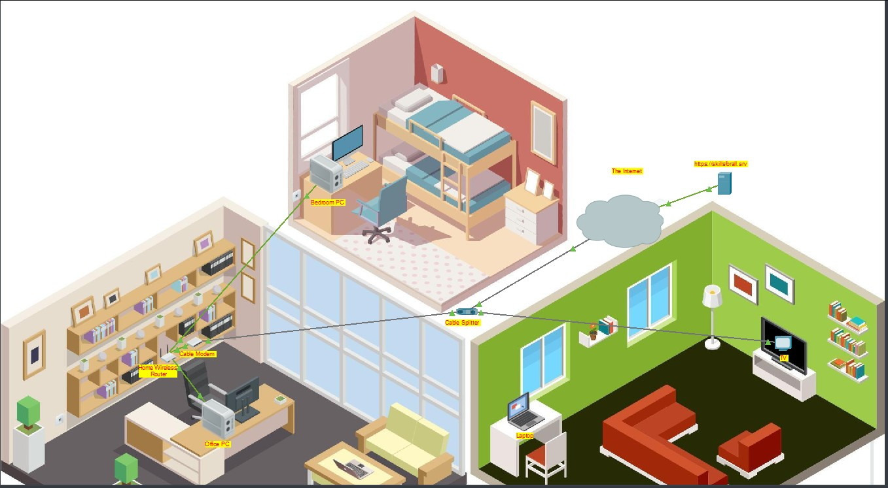
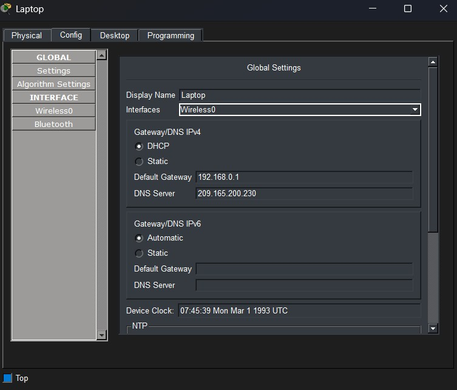
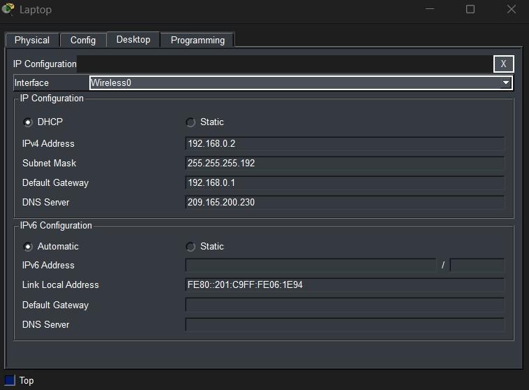
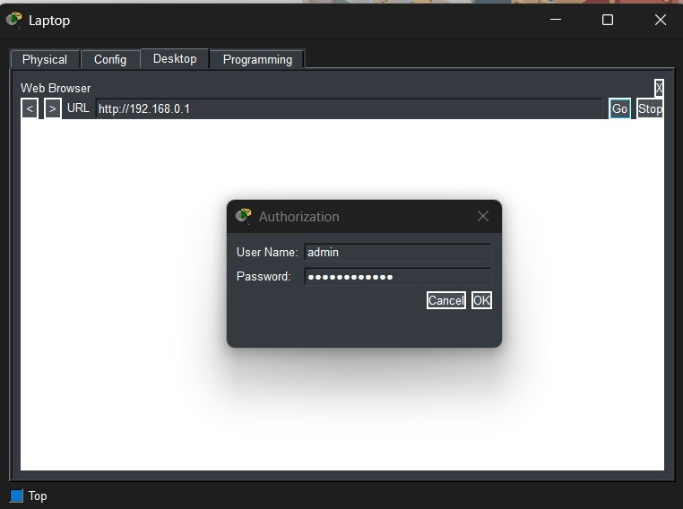
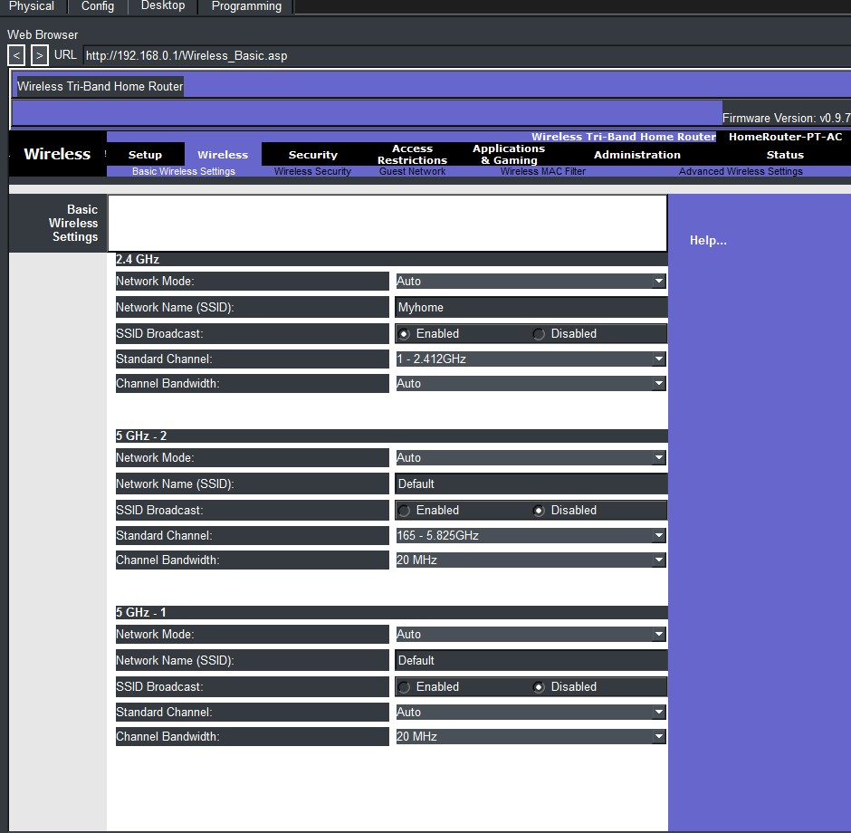
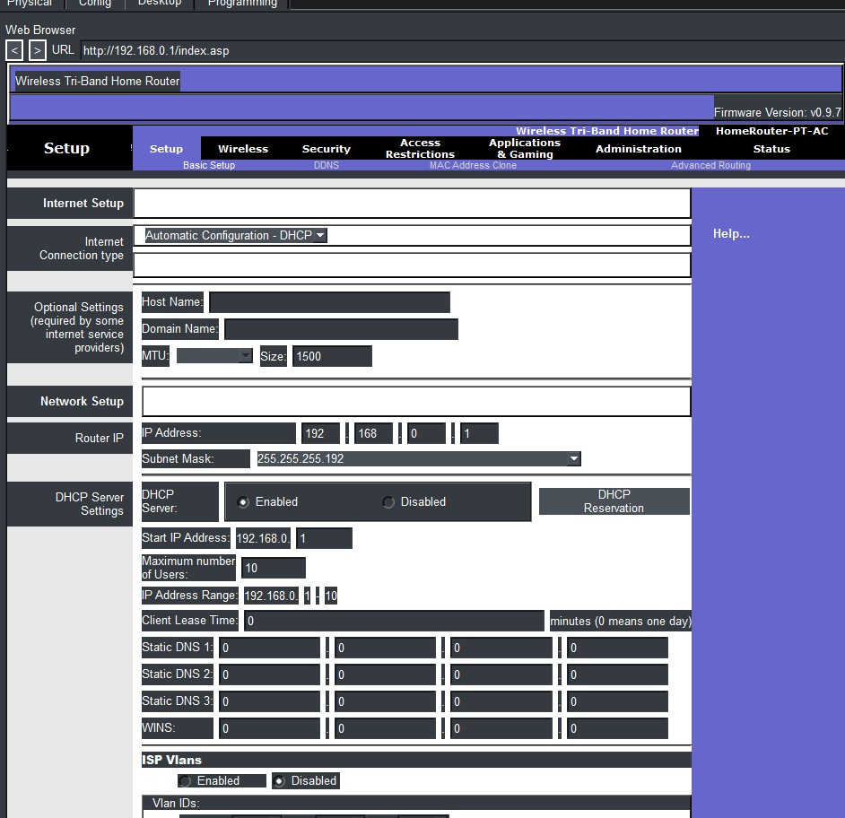
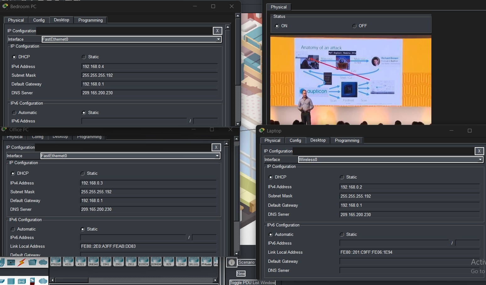

# Lab 01 — Configure a Wireless Router and Client

## 🎯 Objective
Configure a wireless router, set up DHCP, and test 
connectivity between devices.

## 🛠 Tools
- Cisco Packet Tracer

## 📋 Steps
1. Build the network topology
2. Login to the router admin panel
3. Configure SSID and wireless settings
4. Set up DHCP for automatic IP assignment
5. Test connectivity using ping
6. Verify all devices received IP addresses

## 📸 Screenshots

### Network Topology

### Router Login

### SSID Configuration

### DHCP Setup

### IP Assignments

### Ping Test

### All Devices IP Config

