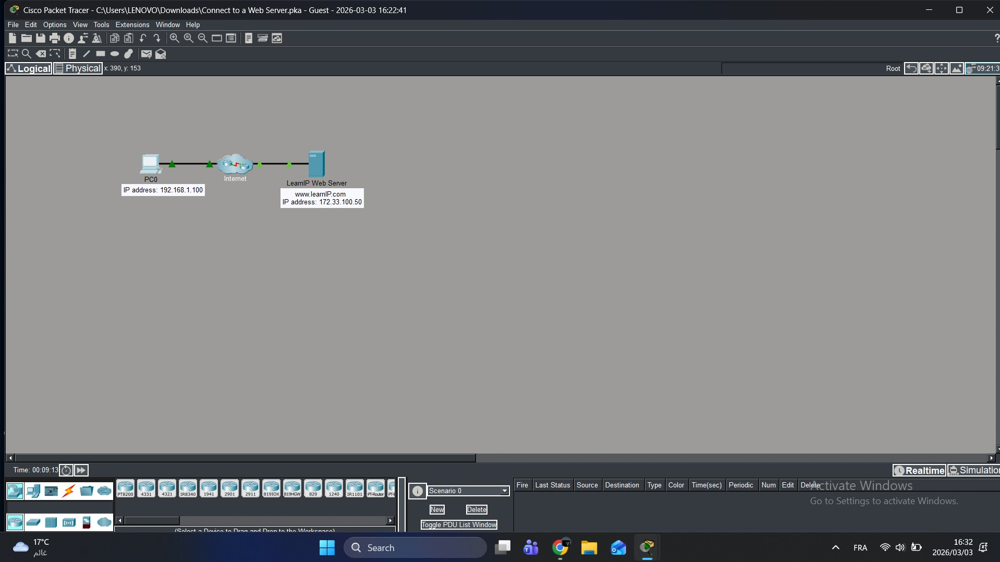
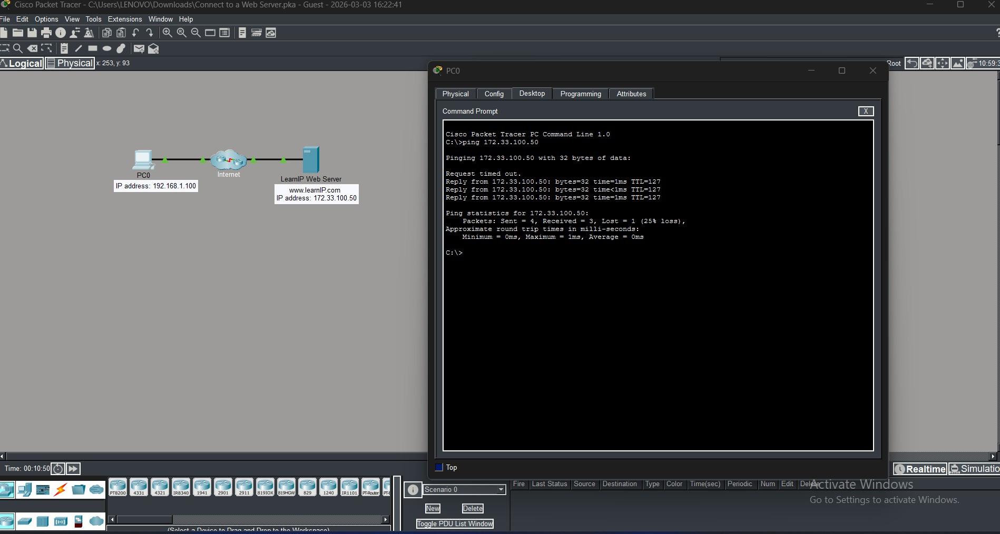
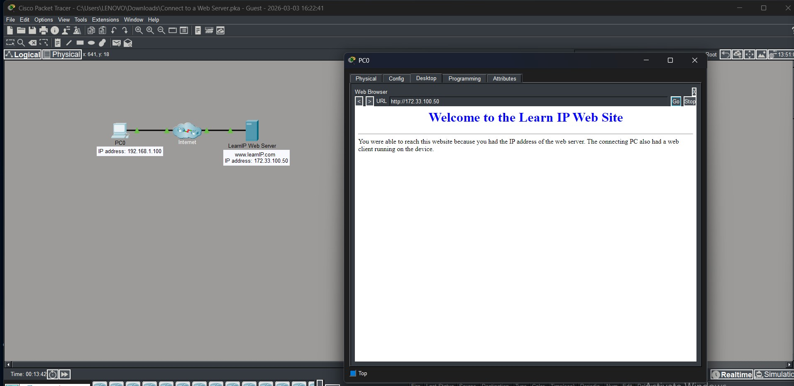
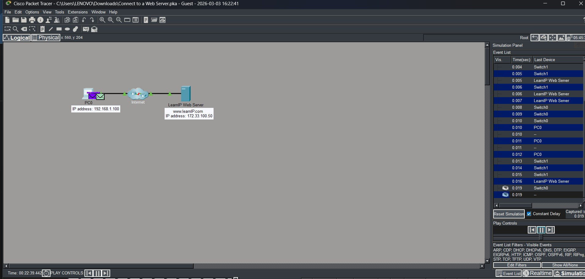
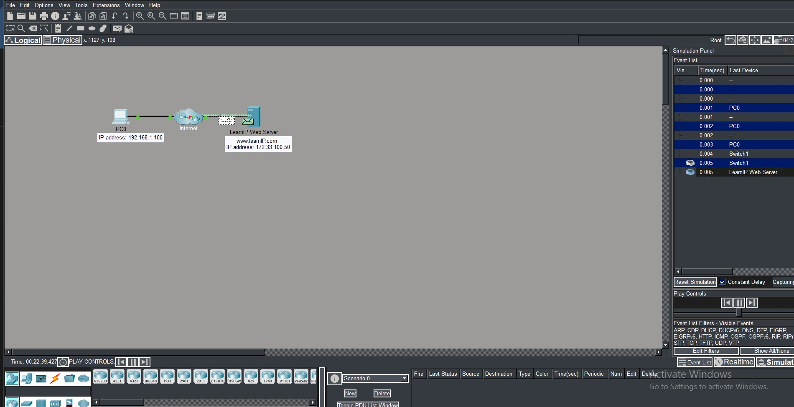

# Lab 02 — Connect to a Web Server

## 🎯 Objective
Connect a PC to a remote web server over the internet
using IP address and verify connectivity.

## 🛠 Tools
- Cisco Packet Tracer

## 🌐 Network Info
| Device | IP Address |
|--------|-----------|
| PC0 | 192.168.1.100 |
| LearnIP Web Server | 172.33.100.50 |
| Website | www.learnIP.com |

## 📋 Steps
1. Build topology: PC0 → Internet → LearnIP Web Server
2. Assign IP addresses to devices
3. Test connectivity using ping
4. Access web server via browser using IP address
5. Observe packet flow in Simulation mode

## 📸 Screenshots

### Network Topology

### Ping Test

### Web Browser Access

### Simulation Panel

### Packet Flow

